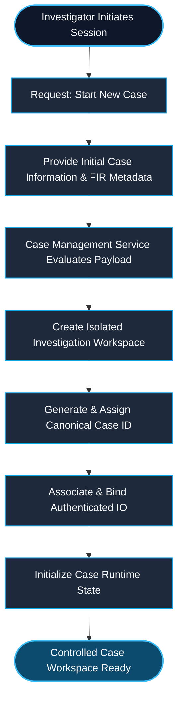
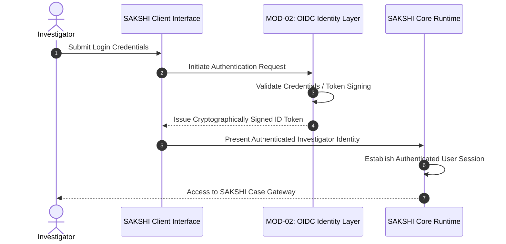
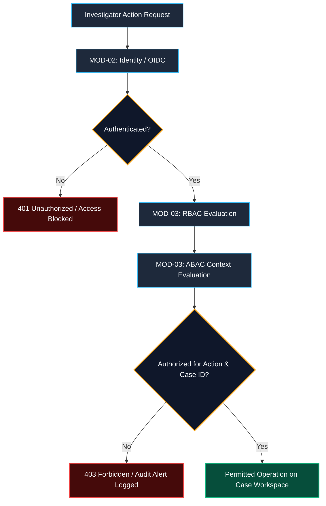
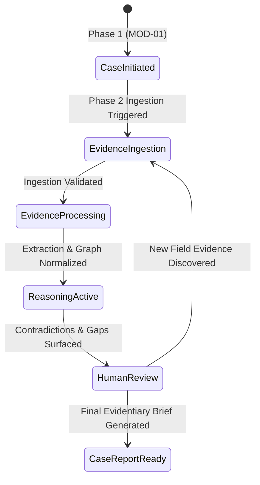

# SAKSHI — Phase 1: Case Initiation
## Technical Presentation Deck & Engineering Defense Specification

> **Theme Styling Directive:** Dark Navy (`#090D16`), Electric Cyan (`#00F0FF` / `#38BDF8`), Muted Blue-Gray (`#94A3B8`), Border Slate (`#1E293B`), Pure White (`#FFFFFF`).  
> **Source-Definitive Integrity:** Grounded strictly in the SAKSHI Architecture & Engineering Specifications without unverified assumptions or invented police SOPs.

---

# SECTION 1: MOD-01 — CASE MANAGEMENT SERVICE
*Source-Defined Function:* **"Create case / assign IO"**

---

### SLIDE 1 — Module Overview
#### **MOD-01 — Case Management Service: Establishing the Evidentiary Boundary**

```
 ┌────────────────────────────────────────────────────────┐
 │                   INPUT CONTEXT                        │
 │        FIR Metadata   +   IO Context Credentials       │
 └──────────────────────────┬─────────────────────────────┘
                            │
                            ▼
 ┌────────────────────────────────────────────────────────┐
 │           MOD-01: CASE MANAGEMENT SERVICE              │
 │          [Creates Case Workspace & Assigns IO]         │
 └──────────────────────────┬─────────────────────────────┘
                            │
                            ▼
 ┌────────────────────────────────────────────────────────┐
 │                  PHASE 1 ARTIFACTS                     │
 │          Controlled Case Workspace  +  Case ID         │
 └──────────────────────────┬─────────────────────────────┘
                            │
                            ▼
 ┌────────────────────────────────────────────────────────┐
 │             PHASE 2 — EVIDENCE INGESTION               │
 └────────────────────────────────────────────────────────┘
```

#### Core Architectural Drivers:
* **What it is:** The foundational administrative engine of SAKSHI responsible for initializing an investigation workspace, generating a universally unique, immutable `Case ID`, and binding the authorized Investigating Officer (IO) to the legal matter.
* **Why required in Case Initiation:** Forensic AI cannot ingest arbitrary, unanchored data. Before any evidence is parsed, an isolated, auditable workspace boundary must be established to satisfy legal chain-of-custody and prevent cross-case data contamination.
* **Position in Phase 1:** Serves as the operational anchor of Phase 1, converting external registration data into an active, managed workspace context.
* **Relationship with the IO:** Binds the officer's verified identity to all downstream operations, establishing immediate operational accountability.
* **Relationship with Case ID & Workspace:** Formulates the root coordinate (`Case ID`) upon which the internal workspace and all subsequent evidence graphs are anchored.

---

### SLIDE 2 — Case Creation Workflow
#### **Step-by-Step Workspace Initialization Flow**



#### Step Breakdown:
1. **Investigator Request:** Authorized officer triggers case initialization.
2. **FIR Ingestion:** Initial registration metadata (FIR number, police station, jurisdiction, timestamp) is supplied.
3. **Workspace Allocation:** MOD-01 allocates an isolated case partition ensuring multi-tenant isolation.
4. **Case ID Generation:** A cryptographically secure, canonical `Case ID` is issued as the root key.
5. **IO Binding:** The authenticated investigator's identity record is permanently coupled with this case record.
6. **Case Initialization:** Runtime metadata is initialized, preparing the workspace for Phase 2 ingestion.

---

### SLIDE 3 — The Case ID as the Evidentiary Spine
#### **Universal Downstream Reference Architecture**

The `Case ID` is not merely a database primary key; it is the **immutable evidentiary spine** to which all downstream multi-modal data, reasoning inferences, and chain-of-custody ledgers link.

```
                            ┌────────────────┐
                            │    CASE-ID     │
                            │  [Root Spine]  │
                            └───────┬────────┘
        ┌──────────────┬────────────┼────────────┬──────────────┐
        │              │            │            │              │
        ▼              ▼            ▼            ▼              ▼
  ┌───────────┐  ┌───────────┐┌───────────┐┌───────────┐  ┌───────────┐
  │ Physical  │  │ Structured││ Multi-    ││ Audio /   │  │ Telephony │
  │ Evidence  │  │ Documents ││ Modal Pix ││ Transcribe│  │ CDR Dumps │
  └─────┬─────┘  └─────┬─────┘└─────┬─────┘└─────┬─────┘  └─────┬─────┘
        │              │            │            │              │
        └──────────────┴────────────┼────────────┴──────────────┘
                                    │
                                    ▼
                      ┌───────────────────────────┐
                      │    DERIVED ARTIFACTS      │
                      │  ├── Extracted Events     │
                      │  ├── Timeline Graphs      │
                      │  ├── Contradictions       │
                      │  └── Investigation Gaps   │
                      └───────────────────────────┘
```

#### Architectural Importance:
* **Stable Downstream Reference:** Downstream components (Whisper ASR, Legal NER, Neo4j Graph Engine, Postgres Case Store) reference this singular anchor.
* **Forensic Provenance:** Eliminates orphaned records; every contradiction, extracted entity, or gap inquiry carries the root `Case ID`.
* **Zero Contamination:** Strict partitioning guarantees that cross-case reasoning or heuristic contamination cannot occur.

---

### SLIDE 4 — The Case Workspace Architecture
#### **Structural Composition of the Investigation Workspace**

```
Case Workspace (Logical Partition)
│
├── 1. Case Identity
│      └── Canonical Case ID & Case Hash Anchor
│
├── 2. Initial Case Metadata
│      └── FIR Details, Legal Sections, Inception Timestamp, Station Origin
│
├── 3. Investigator Association
│      └── Primary IO ID, Designation, Assignment Timestamp
│
├── 4. Lifecycle Context
│      └── Active Stage Pointer (Synchronized via MOD-04 Stage Engine)
│
└── 5. Evidentiary & Derived Artifact Sub-Containers
       └── Ingested Documents, Media, Knowledge Graph Subgraphs, Audit Logs
```

#### Strict Architectural Boundary:
* **Source-Defined Architecture:** MOD-01 creates the logical envelope and establishes the investigator binding.
* **Conceptual Distinction:** The workspace is a *logical context container*, separating tenant space and ensuring that unverified hypotheses or raw ingested files remain bounded strictly within this legal matter.

---

### SLIDE 5 — Module Input / Output Contract
#### **Interface Specification: Handoff to Phase 2**

```
┌────────────────────────────────────────────────────────────────────────┐
│ INPUT CONTRACT                                                         │
│ • FIR Metadata (Police station jurisdiction, FIR number, date of filing)│
│ • IO Context (Authenticated officer credentials & unique IO identifier)│
└───────────────────────────────────┬────────────────────────────────────┘
                                    │
                                    ▼
┌────────────────────────────────────────────────────────────────────────┐
│ MODULE: MOD-01 CASE MANAGEMENT SERVICE                                 │
│ • Validates metadata completeness                                      │
│ • Allocates workspace enclosure                                        │
│ • Generates canonical Case ID & associates IO                          │
└───────────────────────────────────┬────────────────────────────────────┘
                                    │
                                    ▼
┌────────────────────────────────────────────────────────────────────────┐
│ OUTPUT CONTRACT                                                        │
│ • Active Case Workspace Context                                        │
│ • Canonical Case ID                                                    │
│ • Verified IO Association Record                                       │
└───────────────────────────────────┬────────────────────────────────────┘
                                    │
                                    ▼
┌────────────────────────────────────────────────────────────────────────┐
│ NEXT CONSUMER: PHASE 2 — EVIDENCE INGESTION                            │
│ • Uses Case ID to tag incoming PDFs, scans, voice recordings, and CDRs │
│ • Mounts raw evidentiary files into the created Case Workspace         │
└────────────────────────────────────────────────────────────────────────┘
```

---

### SLIDE 6 — MOD-01 Viva Examination Defense
#### **Quick-Fire Technical Summary for Examiners**

> **Official Viva Articulation:**  
> *"The Case Management Service (MOD-01) creates the investigation workspace and establishes the Case ID that identifies the case throughout the SAKSHI pipeline. It also associates the Investigating Officer with the case. This creates the controlled case context required before evidence is ingested in Phase 2."*

#### Key Defense Answers:
* **Q: Why can't we immediately start ingesting documents without MOD-01?**  
  *Answer:* Without an initialized case workspace and an immutable `Case ID`, ingested files lack legal chain-of-custody context and multi-tenant partitioning, risking evidentiary contamination and inadmissible forensics.
* **Q: Does MOD-01 validate the truth of FIR statements?**  
  *Answer:* No. MOD-01 only creates the structural record and assigns the IO. Factual validation and consistency checking are deferred to the Evidence Gate and downstream reasoning engines.

---

# SECTION 2: MOD-02 — IDENTITY / OIDC
*Source-Defined Function:* **"Authenticate investigator"**

---

### SLIDE 1 — Module Overview
#### **MOD-02 — Identity / OIDC: Verifying the Investigator**

```
 ┌────────────────────────────────────────────────────────────────┐
 │                      AUTHENTICATION (MOD-02)                   │
 │                     "WHO ARE YOU?"                             │
 │    Verifies cryptographic identity of the human investigator   │
 └───────────────────────────────┬────────────────────────────────┘
                                 │
                                 ▼
 ┌────────────────────────────────────────────────────────────────┐
 │                      AUTHORIZATION (MOD-03)                    │
 │                 "WHAT ARE YOU ALLOWED TO DO?"                  │
 │          Evaluates roles & policies for protected actions      │
 └────────────────────────────────────────────────────────────────┘
```

#### Core Principles:
* **What it is:** The standardized OpenID Connect (OIDC) identity federation layer that authenticates law enforcement officers before they interact with SAKSHI.
* **Why required in Phase 1:** SAKSHI operates on sensitive criminal case records, post-mortem findings, and digital forensics. An authenticated identity is mandatory to enforce legal accountability and sign audit logs.
* **Position in Phase 1:** Precedes case access. Identity must be cryptographically established before any case creation or retrieval is permitted.
* **Authentication vs. Authorization:** Authentication verifies *identity* ("Who are you?"). It does not grant arbitrary rights—what the user is permitted to do is handled strictly downstream by MOD-03 (RBAC/ABAC).

---

### SLIDE 2 — Authentication Flow
#### **Standardized OIDC Identity Handshake**



#### Stepwise Execution:
1. **Authentication Request:** Officer triggers authentication through the secure SAKSHI interface.
2. **OIDC Processing:** OIDC identity layer verifies credentials using standard federated token exchange.
3. **Signed Token Generation:** Identity token containing verifiable claims is emitted.
4. **Context Injection:** SAKSHI consumes the authenticated identity into the user session context.

---

### SLIDE 3 — The OIDC Architectural Concept
#### **OpenID Connect as an Open Standard**

```
   ┌───────────────────┐
   │ Human Investigator│
   └─────────┬─────────┘
             │
             ▼
   ┌───────────────────┐
   │    OIDC LAYER     │ ◄─── Open standard built on OAuth 2.0
   │  (Identity Spec)  │      Decoupled from core reasoning logic
   └─────────┬─────────┘
             │
             ▼
   ┌───────────────────┐
   │   AUTHENTICATED   │ ◄─── Signed Claims:
   │     IDENTITY      │      (Subject ID, Officer Name, Badge ID)
   └─────────┬─────────┘
             │
             ▼
   ┌───────────────────┐
   │   SAKSHI SYSTEM   │
   └───────────────────┘
```

#### Standard Architectural Discipline:
* **Open Standard Compliance:** OpenID Connect (OIDC) provides token-based identity verification without embedding proprietary, custom authentication code into the core AI pipeline.
* **Decoupled Architecture:** SAKSHI stays agnostic to the specific identity backend (state police directory, active directory, or central credentialing authority).
* **Cryptographic Tamper-Resistance:** Eliminates header spoofing; session claims carry verifiable digital signatures.

---

### SLIDE 4 — Identity → Case Association
#### **Bridging Authenticated Identity with Case Context**

```
┌─────────────────────────────────┐
│   AUTHENTICATED INVESTIGATOR    │
│   (Validated by MOD-02 OIDC)    │
└────────────────┬────────────────┘
                 │
                 ▼
┌─────────────────────────────────┐
│    CASE MANAGEMENT (MOD-01)     │
│   Binds Officer as Case Lead    │
└────────────────┬────────────────┘
                 │
                 ▼
┌─────────────────────────────────┐
│     CASE WORKSPACE (Case ID)    │
│   Case record carries IO ref    │
└────────────────┬────────────────┘
                 │
                 ▼
┌─────────────────────────────────┐
│   AUTHORIZED CASE OPERATIONS    │
│   (Governed downstream by MOD-03)│
└─────────────────────────────────┘
```

#### Boundary Verification:
* The authenticated identity provides the *caller context* for MOD-01 to bind an assigned IO.
* The presence of an authenticated identity token does **not** grant unilateral case edit privileges; authorization checks (MOD-03) are required for every operation.

---

### SLIDE 5 — MOD-02 Viva Examination Defense
#### **Quick-Fire Technical Summary for Examiners**

> **Official Viva Articulation:**  
> *"Identity/OIDC (MOD-02) authenticates the investigator before protected case operations are performed. It establishes who is interacting with SAKSHI. The authorization decision is handled separately through RBAC/ABAC."*

#### Key Defense Answers:
* **Q: Why use OIDC rather than simple username/password database checks?**  
  *Answer:* Standard OIDC allows secure, auditable, federated authentication, eliminating hard-coded credentials in the application and adhering to zero-trust law-enforcement architecture standards.
* **Q: If an officer is authenticated via OIDC, can they view any case in the system?**  
  *Answer:* No. OIDC only answers *who* the officer is. Access permissions to specific cases are strictly enforced by MOD-03 (RBAC/ABAC).

---

# SECTION 3: MOD-03 — RBAC / ABAC AUTHORIZATION
*Source-Defined Function:* **"Restrict access"**

---

### SLIDE 1 — Module Overview
#### **MOD-03 — Access Control: Enforcing Policy Boundaries**

```
┌────────────────────────────────────────────────────────┐
│                      AUTHENTICATION                    │
│                     (MOD-02 OIDC)                      │
│                  "Who is the caller?"                  │
└───────────────────────────┬────────────────────────────┘
                            │ Verified Subject
                            ▼
┌────────────────────────────────────────────────────────┐
│             AUTHORIZATION (MOD-03 RBAC / ABAC)         │
│                 "Is this action allowed?"              │
│       Restricts access to cases, files, & mutations    │
└───────────────────────────┬────────────────────────────┘
                            │ Allowed / Denied
                            ▼
┌────────────────────────────────────────────────────────┐
│               PROTECTED CASE OPERATIONS                │
└────────────────────────────────────────────────────────┘
```

#### Core Principles:
* **What it is:** The dual access control subsystem enforcing Role-Based Access Control (RBAC) and Attribute-Based Access Control (ABAC).
* **Why required in Phase 1:** Death investigations involve highly sensitive, sealed records (autopsy photographs, confidential informant statements, ballistic lab reports). Unauthorized access or accidental modification compromises legal admissibility.
* **Position in Phase 1:** Positioned immediately following authentication, wrapping every request before case workspace access or pipeline mutation is permitted.

---

### SLIDE 2 — Role-Based Access Control (RBAC)
#### **Coarse-Grained Governance by Assigned Role**

```
┌───────────────────────────────┐
│      AUTHENTICATED USER       │
└───────────────┬───────────────┘
                │
                ▼
┌───────────────────────────────┐
│         ASSIGNED ROLE         │
│  (e.g., Lead IO, Reviewer,    │
│   Forensic Analyst, Reader)   │
└───────────────┬───────────────┘
                │
                ▼
┌───────────────────────────────┐
│        ROLE PERMISSIONS       │
│  (ReadCase, IngestEvidence,   │
│   RunReasoning, ExportReport) │
└───────────────┬───────────────┘
                │
                ▼
┌───────────────────────────────┐
│       ALLOWED OPERATIONS      │
└───────────────────────────────┘
```

#### Conceptual Mechanism:
* Users are assigned coarse roles.
* Permissions are bound to roles rather than directly to individual users.
* Simplifies basic organizational security checks across general system functions.

---

### SLIDE 3 — Attribute-Based Access Control (ABAC)
#### **Fine-Grained Context-Aware Governance**

```
   ┌─────────────────────────────────────────────────────────┐
   │ USER ATTRIBUTES   : [Officer ID, Unit, Jurisdiction]    │
   │ CASE ATTRIBUTES   : [Case ID, Assigned IO, Case Status] │
   │ CONTEXT ATTRIBUTES: [Time, Network Origin, Station]     │
   └────────────────────────────┬────────────────────────────┘
                                │
                                ▼
   ┌─────────────────────────────────────────────────────────┐
   │               ABAC AUTHORIZATION POLICY                 │
   │ "Allow Ingestion IF User.ID == Case.Assigned_IO         │
   │  AND Case.Status != 'SEALED' AND Origin == 'SECURE_LAN'"│
   └────────────────────────────┬────────────────────────────┘
                                │
                                ▼
                     ┌────────────────────┐
                     │   ALLOW / DENY     │
                     └────────────────────┘
```

#### Why ABAC is Crucial for Forensic AI:
* RBAC alone cannot prevent an IO from accessing an active case assigned to another officer in a different jurisdiction.
* ABAC evaluates dynamic variables: *Is this officer the assigned lead for this specific Case ID? Is the case currently under judicial review or locked?*

---

### SLIDE 4 — Integrated Auth Pipeline
#### **End-to-End Handshake: From Login to Execution**



#### Architectural Decoupling:
1. **Separation of Concerns:** Identity establishment (OIDC) is fully separated from access control (RBAC/ABAC).
2. **Defensive Perimeter:** Every API invocation and case workspace mutation is gated through this two-tier validation.

---

### SLIDE 5 — MOD-03 Viva Examination Defense
#### **Quick-Fire Technical Summary for Examiners**

> **Official Viva Articulation:**  
> *"RBAC/ABAC (MOD-03) restricts access after the investigator has been authenticated. RBAC uses roles and permissions, while ABAC can use additional attributes and context. Together they establish the authorization boundary around the case."*

#### Key Defense Answers:
* **Q: Why is RBAC alone insufficient for SAKSHI?**  
  *Answer:* In police investigations, two users may have the exact same role ("Investigating Officer"), but Officer A must not access or edit Officer B's confidential homicide investigation without specific authorization. ABAC provides this case-specific attribute gating.
* **Q: Does MOD-03 restrict what the AI reasoning engine can see?**  
  *Answer:* Yes. MOD-03 scopes the workspace boundary so that the reasoning engine only retrieves context anchored to the specific authorized `Case ID`.

---

# SECTION 4: MOD-04 — STAGE ENGINE
*Source-Defined Function:* **"Control lifecycle"**

---

### SLIDE 1 — Module Overview
#### **MOD-04 — Stage Engine: Investigation Lifecycle Orchestration**

```
┌────────────────────────────────────────────────────────┐
│                      CASE CREATED                      │
│                    (via MOD-01 & 02)                   │
└───────────────────────────┬────────────────────────────┘
                            │
                            ▼
┌────────────────────────────────────────────────────────┐
│                 MOD-04: STAGE ENGINE                   │
│        Tracks, advances, and validates case state      │
└───────────────────────────┬────────────────────────────┘
                            │
                            ▼
┌────────────────────────────────────────────────────────┐
│                   CURRENT CASE STAGE                   │
│    [Initiation ➔ Ingestion ➔ Processing ➔ Reasoning]   │
└───────────────────────────┬────────────────────────────┘
                            │
                            ▼
┌────────────────────────────────────────────────────────┐
│                 CONTROLLED WORKFLOW                    │
│      Prevents out-of-order or invalid transitions      │
└────────────────────────────────────────────────────────┘
```

#### Core Principles:
* **What it is:** The state machine subsystem that tracks and governs the operational lifecycle status of the investigation.
* **Why required in Phase 1:** Investigations are disciplined legal workflows. Raw evidence cannot be sent to advanced cognitive reasoning until extraction and normalization are complete.
* **Position in Phase 1:** Initialized during Phase 1 to define the case's starting stage and govern state changes across all downstream phases.

---

### SLIDE 2 — The Investigation Lifecycle State Concept
#### **Governed State Progression**



#### Lifecycle Rules:
* **Controlled Progression:** System services check the current lifecycle state before executing long-running forensic tasks.
* **Non-Monolithic Evolution:** Real investigations are cyclical—when human review surfaces an evidentiary gap, the lifecycle supports regulated loops back to ingestion.
* **Agnostic Design:** The engine supports configured system workflow states without assuming unsupported, rigid police SOP codes.

---

### SLIDE 3 — Stage Engine & Case Workspace Synchronization
#### **State Persistence in the Case Context**

```
 ┌────────────────────────────────────────────────────────┐
 │                 CASE WORKSPACE CONTEXT                 │
 │       Case ID: SAKSHI-2026-CR-0084                     │
 │       Current Lifecycle State: 'EVIDENCE_INGESTION'    │
 └──────────────────────────┬─────────────────────────────┘
                            │
                            ▼
 ┌────────────────────────────────────────────────────────┐
 │                  MOD-04: STAGE ENGINE                  │
 │   Evaluates State Prerequisites & Transition Events    │
 └──────────────────────────┬─────────────────────────────┘
                            │ Emits Updated Lifecycle State
                            ▼
 ┌────────────────────────────────────────────────────────┐
 │                 DOWNSTREAM SERVICES                    │
 │       (Ingestion Gateways, Timeline Engines, ASR)      │
 └──────────────────────────┬─────────────────────────────┘
                            │ Updates Execution Metrics
                            ▼
 ┌────────────────────────────────────────────────────────┐
 │             PERSISTED UPDATED CASE STATE               │
 └────────────────────────────────────────────────────────┘
```

#### Technical Operation:
* The Stage Engine holds the authoritative transition logic.
* State transitions are recorded as signed lifecycle events, providing a clear administrative history of how the investigation evolved.

---

### SLIDE 4 — Why Lifecycle Control Matters
#### **Preventing Architectural Chaos & premature Inference**

* **Eliminates "Unstructured File Dumps":** Without a lifecycle engine, a case degenerates into an unorganized repository of conflicting files where models infer conclusions on partial data.
* **Protects Evidence-Gated Integrity:** Ensures that candidate hypotheses from the "Intuition Brain" cannot be processed until the case reaches the appropriate analytical phase.
* **Provides Context to Downstream Engines:** Ingestion pipelines, OCR processors, and Graph builders query the Stage Engine to verify if mutations are currently permitted.
* **Zero Autonomous Decision-Making:** The Stage Engine enforces procedural gates; it does **not** draw investigative conclusions or evaluate evidence veracity.

---

### SLIDE 5 — MOD-04 Viva Examination Defense
#### **Quick-Fire Technical Summary for Examiners**

> **Official Viva Articulation:**  
> *"The Stage Engine (MOD-04) controls the lifecycle state of the investigation. It provides structured workflow context so that the case is not treated as an unorganized collection of files. The lifecycle context is then available to downstream SAKSHI components."*

#### Key Defense Answers:
* **Q: Does the Stage Engine decide whether a suspect is guilty?**  
  *Answer:* Absolutely not. SAKSHI enforces the Cardinal Anti-Suspect Rule. The Stage Engine is strictly a workflow state coordinator managing operational case progress.
* **Q: What happens if an investigator uploads new evidence after initial analysis?**  
  *Answer:* The Stage Engine handles the transition back to Evidence Ingestion/Processing, enabling the closed-loop evidentiary cycle to update the graph.

---

# SECTION 5: PHASE 1 MASTER INTEGRATION
*Unified Subsystem Architecture*

---

### MASTER SLIDE — Phase 1 Module Integration
#### **Establishing the Controlled Evidentiary Boundary Prior to Ingestion**

```
┌─────────────────────────────────────────────────────────────────────────────────┐
│ INPUT: FIR Metadata + Initial Inception Data  |  Investigator Credentials       │
└────────────────────────────────────────┬────────────────────────────────────────┘
                                         │
                                         ▼
┌─────────────────────────────────────────────────────────────────────────────────┐
│                               PHASE 1: CASE INITIATION                          │
│                                                                                 │
│   ┌────────────────────────────────┐        ┌───────────────────────────────┐   │
│   │ MOD-02: Identity / OIDC        │        │ MOD-03: RBAC / ABAC           │   │
│   │ Function: Authenticate IO      │───────►│ Function: Restrict Access     │   │
│   └────────────────────────────────┘        └──────────────┬────────────────┘   │
│                                                            │                    │
│                                                            ▼                    │
│   ┌────────────────────────────────┐        ┌───────────────────────────────┐   │
│   │ MOD-04: Stage Engine           │        │ MOD-01: Case Management      │   │
│   │ Function: Control Lifecycle    │◄───────│ Function: Create Case /       │   │
│   │                                │        │           Assign IO           │   │
│   └──────────────┬─────────────────┘        └──────────────┬────────────────┘   │
│                  │                                         │                    │
│                  └────────────────────┬────────────────────┘                    │
└───────────────────────────────────────┼─────────────────────────────────────────┘
                                        │
                                        ▼
┌─────────────────────────────────────────────────────────────────────────────────┐
│ OUTPUT: Controlled Case Workspace  +  Canonical Case ID  +  Bound IO Record     │
└───────────────────────────────────────┬─────────────────────────────────────────┘
                                        │
                                        ▼
┌─────────────────────────────────────────────────────────────────────────────────┐
│ NEXT PHASE: PHASE 2 — EVIDENCE INGESTION                                        │
│ (Multi-Modal Ingestion: Post-Mortem, Lab Reports, FSL, Scene Photos, CDR Dumps) │
└─────────────────────────────────────────────────────────────────────────────────┘
```

#### Comprehensive Phase 1 Matrix:

| Subsystem Module | Source-Defined Formal Function | Primary Architectural Responsibility | Downstream Contribution |
| :--- | :--- | :--- | :--- |
| **MOD-01** Case Management Service | **"Create case / assign IO"** | Initializes isolated workspace, creates root `Case ID`, and associates officer | Root key anchor for all multi-modal evidence & graphs |
| **MOD-02** Identity / OIDC | **"Authenticate investigator"** | Verifies officer identity via standard token-based federation | Legal non-repudiation and audit log signing |
| **MOD-03** RBAC / ABAC | **"Restrict access"** | Enforces role permissions and dynamic attribute-based security boundaries | Prevents unauthorized case access and tampering |
| **MOD-04** Stage Engine | **"Control lifecycle"** | Governs investigation state machine and enforces procedural sequence | Workflow state context across all downstream phases |

#### Fundamental Architectural Note on Sequence:
> **Logical Workflow vs. Source Prescription:** While the architecture identifies these four specific modules and their distinct functions, it treats the interaction sequence as a **logical workflow** rather than a rigid, monolithic internal instruction pipeline. In practice, Identity (MOD-02) and Access Control (MOD-03) gate the invocation of the Case Management Service (MOD-01), which then initializes the Stage Engine (MOD-04) within the resulting Case Workspace.

**Summary Takeaway for Defense:**  
*Phase 1 guarantees that before even a single byte of evidence enters SAKSHI in Phase 2, the system has verified WHO is interacting (MOD-02), WHAT they are permitted to do (MOD-03), created an isolated evidentiary workspace with an immutable spine ID (MOD-01), and established the workflow lifecycle state (MOD-04).*
