l the build # SAKSHI: System Pipeline & Subsystem Architecture
## An Evidence-Gated AI Reasoning Agent for Death Investigation

---

## 1. Architectural Evolution & Foundational Context

### 1.1 The Shift from Legacy Conceptualization to Evidence-Gated Discipline

In early investigative AI frameworks and legacy presentation concepts, investigative pipelines were typically modeled as linear extraction and reconstruction systems:

```
[LEGACY CONCEPTUAL PIPELINE]
Evidence Ingestion ──► Text Extraction ──► Entity Extraction ──► Relationship Mapping ──► MO Reconstruction ──► Suspect Output
```

This legacy paradigm carries fatal forensic vulnerabilities:
- **Heuristic Bias & Profiling:** Attempting to reconstruct "Modus Operandi" (MO) or correlate cases based on behavioral similarities inevitably invites confirmation bias and subjective profiling.
- **Uncontrolled Hallucination:** Unconstrained generative models easily invent narrative bridges and elevate speculative hypotheses into factual assertions.
- **Premature Cognitive Closure:** Prematurely ranking or implicating suspects closes alternative lines of inquiry, risking catastrophic investigative failure.

**SAKSHI fundamentally replaces this paradigm with an Evidence-Gated, Two-Brain Architecture:**

```
[SAKSHI EVIDENCE-GATED ARCHITECTURE]
Evidence ──► Extraction ──► Structured Case Memory ──► Context Retrieval
                                                               │
                                                               ▼
                                                    ┌─────────────────────┐
                                                    │   INTUITION BRAIN   │
                                                    └──────────┬──────────┘
                                                               │ Candidate Insight (Isolated)
                                                               ▼
                                                    ┌─────────────────────┐
                                                    │  DISCIPLINE BRAIN   │
                                                    └──────────┬──────────┘
                                                               │
                                                               ▼
                                                       EVIDENCE GATE
                                                               │
                                       ┌───────────────────────┼───────────────────────┐
                                       ▼                       ▼                       ▼
                                   VERIFIED               UNVERIFIED             CONTRADICTORY
                                       │                       │                       │
                                       └───────────────────────┴───────────────────────┘
                                                               │
                                                               ▼
                                                    INVESTIGATION GAPS
                                                               │
                                                               ▼
                                                  EVIDENCE-BACKED NEXT STEPS
                                                               │
                                                               ▼
                                                      HUMAN INVESTIGATOR
                                                               │
                                                               ▼
                                                         NEW EVIDENCE
                                                               │
                                                               └────────► CASE MEMORY UPDATE
```

### 1.2 The Cardinal Anti-Suspect Rule
> **SAKSHI MUST NEVER:**
> - Name, rank, recommend, implicate, or predict a suspect.
> - Calculate guilt probabilities or assign culpability scores.
> - Conduct behavioral, personality, or psychological profiling.
> - Link cases based on appearance, MO, or narrative likeness.
> 
> **SAKSHI'S SOLE PURPOSE:** Serve as an objective evidentiary clerk and cognitive co-pilot: organizing multi-modal evidence, constructing timeline graphs, checking claim consistency, exposing contradictions, surfacing investigative gaps, and formulating verifiable, evidence-backed next steps for the human investigator.

---

## 2. Master System Pipeline

The master pipeline represents the complete, closed-loop operational flow of Sakshi from case creation to ongoing field evidence integration.

```mermaid
flowchart TD
    subgraph S_INIT["1. Case Initiation"]
        INIT["FIR Intake & Secure Workspace Creation"]
    end

    subgraph S_INGEST["2. Evidence Ingestion"]
        INGEST["Multi-Modal Ingestion:\nPDFs, Scans, Photos, Voice Notes, FSL Lab Reports, Digital CDRs"]
    end

    subgraph S_PRE["3. Preprocessing"]
        PRE["OCR, Whisper Speech-to-Text, Language Detection, Text Normalization, Metadata Extraction"]
    end

    subgraph S_PROC["4. Evidence Processing"]
        PROC["Legal NER, Event Extraction, ISO 8601 Temporal Normalization, Hard-ID Extraction, Entity Linkage"]
    end

    subgraph S_MEM["5. Structured Case Memory"]
        MEM["Case Database (Postgres) | Knowledge Graph (Neo4j)\nTimeline Engine | Verification Status Ledger"]
    end

    subgraph S_RETR["6. Context Retrieval"]
        RETR["Subgraph Context Assembly & Temporal Interval Slicing"]
    end

    subgraph S_TWIN["7. Two-Brain Reasoning Engine"]
        subgraph IB_BOX["Intuition Brain (LLM Sandbox)"]
            IB["Pattern Recognition, Anomaly Spotting,\nHypothesis & Candidate Insight Generation"]
        end
        
        FIREWALL{{"Mandatory Informational Firewall\nDirect UI Access Prohibited"}}
        
        subgraph DB_BOX["Discipline Brain (Auditor)"]
            DB["Atomic Claim Decomposition, Document Hash Verification,\nExact Span Matching, Entailment & Sufficiency Check"]
        end
        
        IB --> FIREWALL --> DB
    end

    subgraph S_GATE["8. Evidence Gate"]
        GATE{"Grounding Ratio == 1.0\n& Forensically Consistent?"}
        V_OK["VERIFIED"]
        V_UN["UNVERIFIED"]
        V_CT["CONTRADICTORY"]
        GATE -- Grounding = 1.0 --> V_OK
        GATE -- Incomplete --> V_UN
        GATE -- Conflict --> V_CT
    end

    subgraph S_GAP["9. Gap & Next Steps Engine"]
        GAP["Investigation Gap Detection:\nMissing Evidence, Missing Procedures, Uncorroborated Alibis"]
        STEPS["Evidence-Backed Next Steps:\nLawful Inquiries, Sec 91 Notices, Forensic Requisitions"]
        GAP --> STEPS
    end

    subgraph S_DASH["10. Investigator Workspace"]
        DASH["Investigator Dashboard:\nTimeline Explorer, Contradiction Matrix, Gap Board, Citation Viewer"]
    end

    subgraph S_HITL["11. Human-in-the-Loop & Feedback"]
        REV["Human Deliberation & Verification"]
        ACT["Human Field Action"]
        NEW_EVD["Collection of New Supplementary Evidence"]
        REV --> ACT --> NEW_EVD
    end

    %% Pipeline Connections
    INIT --> INGEST --> PRE --> PROC --> MEM --> RETR --> IB_BOX
    DB_BOX --> GATE
    V_OK & V_UN & V_CT --> GAP
    STEPS --> DASH
    DASH --> REV
    NEW_EVD -.->|Closed-Loop Feedback| INGEST

    classDef init fill:#1e293b,stroke:#38bdf8,stroke-width:1.5px,color:#fff;
    classDef mem fill:#1e1b4b,stroke:#818cf8,stroke-width:1.5px,color:#fff;
    classDef brain fill:#311042,stroke:#a21caf,stroke-width:2px,color:#fae8ff;
    classDef gate fill:#064e3b,stroke:#059669,stroke-width:2px,color:#ecfdf5;
    classDef human fill:#0f172a,stroke:#38bdf8,stroke-width:1.5px,color:#fff;
    
    class S_INIT,S_INGEST,S_PRE,S_PROC init;
    class S_MEM,S_RETR mem;
    class IB_BOX brain;
    class DB_BOX,S_GATE,V_OK,V_UN,V_CT gate;
    class S_GAP,S_DASH,S_HITL,REV,ACT,NEW_EVD human;
```

---

## 3. Dedicated Subsystem Pipelines

---

### PIPELINE 1 — Evidence Ingestion Pipeline

The Evidence Ingestion pipeline establishes the statutory chain of custody and prepares multi-modal inputs for deterministic processing.

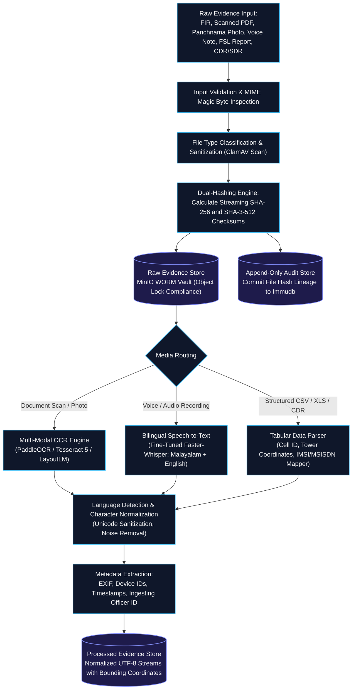

---

### PIPELINE 2 — Information Extraction Pipeline

Converts unstructured and semi-structured text into normalized, typed factual tuples while maintaining strict source attribution.

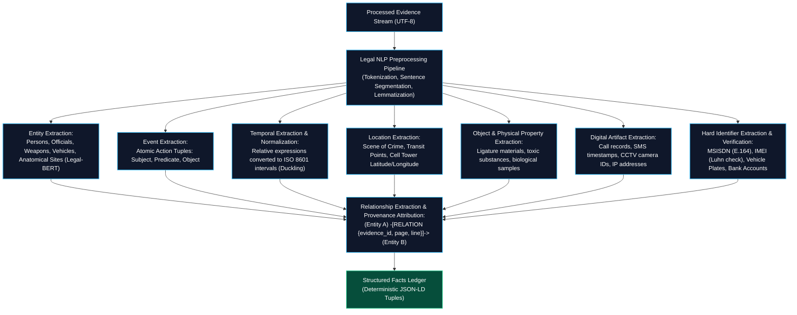

---

### PIPELINE 3 — Structured Case Memory Pipeline

Assembles structured facts into an interconnected, multi-model case memory where every entity and edge carries immutable provenance.

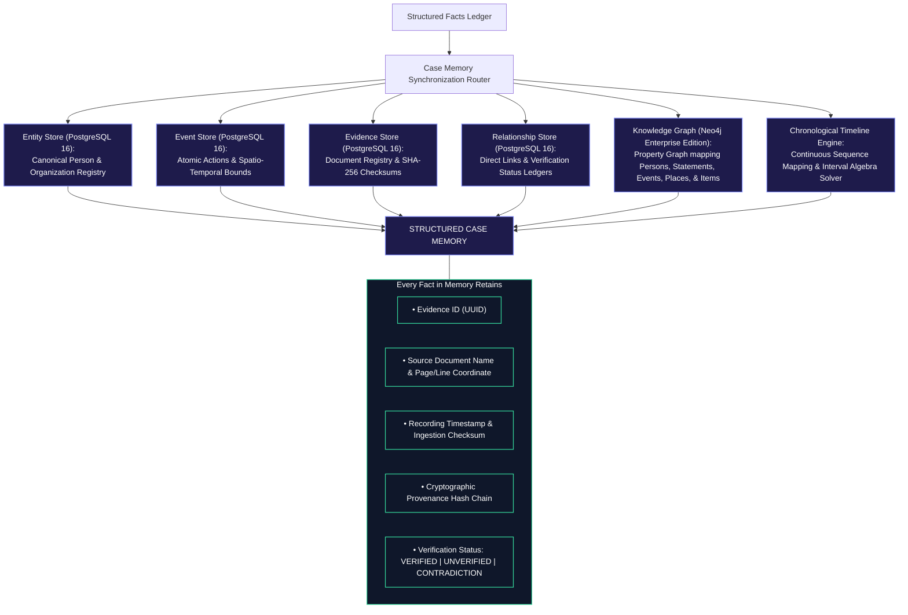

---

### PIPELINE 4 — Timeline Construction & Contradiction Detection Pipeline

Maps temporal events, verifies spatial transit velocity feasibility, and surfaces factual clashes without automated subjective resolution.

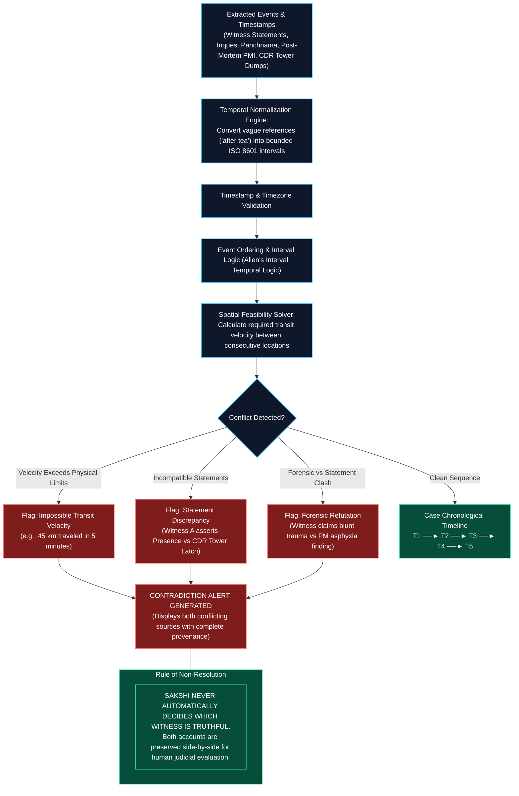

---

### PIPELINE 5 — Intuition Brain (Discovery Layer)

Operates inside an isolated informational sandbox to generate candidate hypotheses without direct access to the investigator.

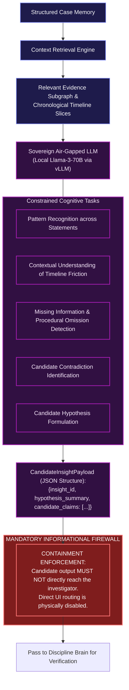

---

### PIPELINE 6 — Discipline Brain (Verification Engine)

Decomposes candidate insights into atomic propositions and executes rigorous documentary verification.

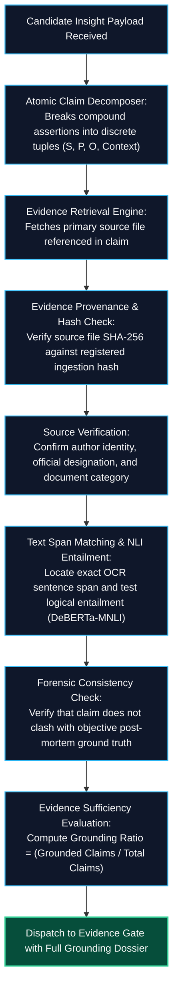

---

### PIPELINE 7 — Evidence Gate Pipeline

The deterministic decision gate that sorts candidate claims into verified facts, unverified leads, or contradictions.

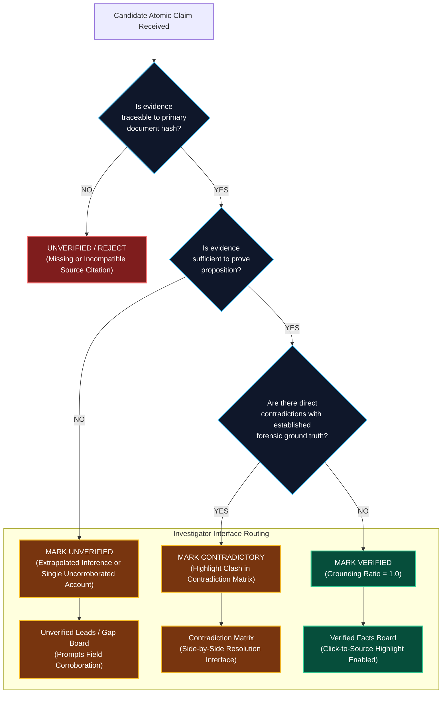

---

### PIPELINE 8 — Investigative Gap Detection Pipeline

Identifies missing evidence, procedural voids, and unverified testimonies, synthesizing lawful next steps without accusing individuals.

```mermaid
flowchart TD
    subgraph INPUTS["Case Memory Inputs"]
        M1["Structured Case Memory"]
        M2["Verified Facts Registry"]
        M3["Unverified Statements"]
        M4["Chronological Timeline"]
        M5["Contradiction Records"]
    end

    INPUTS --> ENGINE["Missing Evidence & Procedural Analysis Engine"]
    
    subgraph SCAN_TYPES["Diagnostic Gap Scanners"]
        S1["Alibi Corroboration Void Scanner"]
        S2["Statutory Forensic Protocol Void Scanner"]
        S3["Timeline Blackout Scanner (> 60 mins unrecorded)"]
        S4["Telecom Corroboration Void Scanner"]
    end
    ENGINE --> SCAN_TYPES
    
    SCAN_TYPES --> GAP_OUT["Identified Investigative Gaps:\n- Gap G1: Victim's 90-minute window prior to PMI unverified\n- Gap G2: Suspect alibi phone lacks Tower CDR corroboration\n- Gap G3: FSL viscera dispatch receipt missing in vault"]
    
    GAP_OUT --> STEPS["Evidence-Backed Next Steps Generator:\n- Requisition Cell Tower CDR via Sec 91 CrPC/BNSS Notice\n- Dispatch requisition for FSL chemical analysis status\n- Summon commercial corridor CCTV for interval 21:00-22:30"]

    subgraph PROHIBITION["Explicit Safety Constraint"]
        WARN["THE SYSTEM MUST NEVER SAY:\n'Person X is lying' OR 'Person X is probably guilty'.\nIt suggests only what evidence/information must be collected."]
    end
    STEPS --- PROHIBITION

    classDef inp fill:#1e293b,stroke:#64748b,stroke-width:1px,color:#fff;
    classDef eng fill:#0f172a,stroke:#38bdf8,stroke-width:1.5px,color:#fff;
    classDef gap fill:#78350f,stroke:#fbbf24,stroke-width:1.5px,color:#fff;
    classDef out fill:#064e3b,stroke:#34d399,stroke-width:1.5px,color:#fff;
    class INPUTS,M1,M2,M3,M4,M5 inp;
    class ENGINE,SCAN_TYPES,S1,S2,S3,S4 eng;
    class GAP_OUT gap;
    class STEPS,PROHIBITION,WARN out;
```

---

### PIPELINE 9 — Cross-Case Hard-Identifier Linkage Pipeline

Restricts cross-case correlations strictly to machine-verifiable tokens, permanently blocking behavioral and profiling attributes.

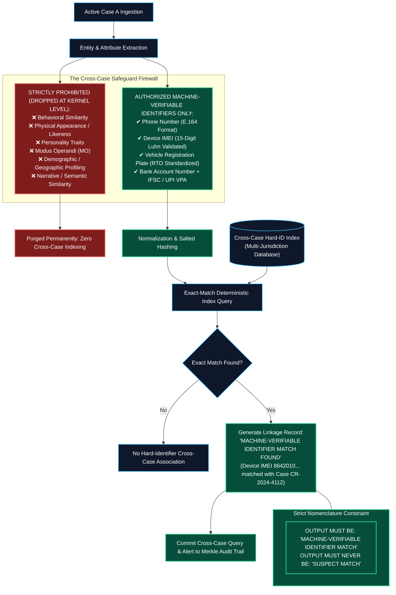

---

### PIPELINE 10 — Legal / Procedural Rule Engine Pipeline

A deterministic, non-LLM subsystem enforcing compliance with statutory criminal procedure codes and forensic preservation deadlines.

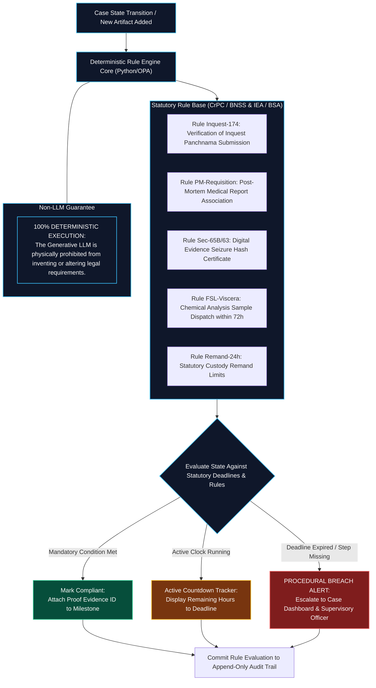

---

### PIPELINE 11 — Reasoning & Court Audit Trail Pipeline

Captures an append-only, tamper-evident record of all system operations, model reasoning states, and investigator decisions.

```mermaid
flowchart LR
    subgraph STAGES["Every Pipeline Stage Commits to Audit"]
        S1["Evidence Ingested\n(File Hash & Metadata)"]
        S2["Preprocessing & Extraction\n(OCR/NER Tokens)"]
        S3["AI Operation\n(Prompt, Context, Model Version)"]
        S4["Evidence Gate\n(Evaluation & Grounding Ratio)"]
        S5["Investigator Action\n(Review, Override, Acceptance)"]
    end

    subgraph MERKLE["Append-Only Merkle Ledger Engine"]
        LEAF["Merkle Leaf Computation:\nSHA-256(Event Payload + Previous Leaf Hash + UTC Timestamp)"]
        LEDGER[("Immudb Cryptographic Ledger\n(WORM Storage Array)")]
        LEAF --> LEDGER
    end

    subgraph DELIVERABLES["Court-Admissible Outputs"]
        PROOF["Cryptographic Consistency Proof"]
        CERT["Statutory Section 65B IEA / Section 63 BSA\nElectronic Record Hash Certificate (Signed PDF)"]
    end

    STAGES --> LEAF
    LEDGER --> PROOF
    LEDGER --> CERT

    subgraph METADATA_FIELDS["Audit Record Fields"]
        F1["• Timestamp (UTC)"]
        F2["• User Identity & Role"]
        F3["• Evidence ID & Checksum"]
        F4["• Model / Rule Engine Version"]
        F5["• Claim & Verification Result"]
        F6["• Human Officer Action & Justification"]
    end
    LEDGER --- METADATA_FIELDS

    classDef stage fill:#1e293b,stroke:#64748b,stroke-width:1px,color:#fff;
    classDef merkle fill:#064e3b,stroke:#34d399,stroke-width:2px,color:#fff;
    classDef out fill:#0f172a,stroke:#38bdf8,stroke-width:1.5px,color:#fff;
    class STAGES,S1,S2,S3,S4,S5 stage;
    class MERKLE,LEAF,LEDGER merkle;
    class DELIVERABLES,PROOF,CERT,METADATA_FIELDS,F1,F2,F3,F4,F5,F6 out;
```

---

### PIPELINE 12 — Human-in-the-Loop Architecture Pipeline

Ensures the Investigating Officer remains the ultimate statutory decision-maker, using Sakshi strictly for evidence organization and reasoning support.

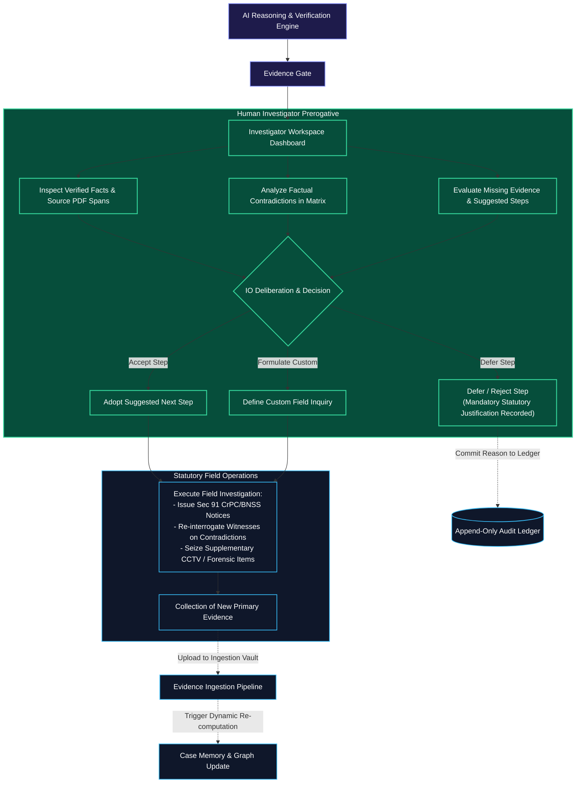

---

## 4. Cross-Cutting Security Overlay

Security is not an endpoint or perimeter wrapper; it spans the **entire depth** of the Sakshi architecture:

```
┌────────────────────────────────────────────────────────────────────────┐
│                   CROSS-CUTTING SECURITY ARCHITECTURE                  │
├────────────────────────────────────────────────────────────────────────┤
│ 1. ACCESS & IDENTITY GOVERNANCE                                        │
│    - Multi-Factor Authentication: FIDO2 Hardware Key + Biometric OTP   │
│    - Role-Based (RBAC) & Attribute-Based (ABAC) Access Control         │
│    - Principle of Least Privilege: Access scoped strictly by Case ID   │
├────────────────────────────────────────────────────────────────────────┤
│ 2. CRYPTOGRAPHIC DATA INTEGRITY & ENCRYPTION                           │
│    - Ingestion Dual-Hashing: SHA-256 + SHA-3-512 streaming checksums   │
│    - Storage at Rest: AES-256-GCM Envelope Encryption (KMS Key/Case)   │
│    - Data in Flight: TLS 1.3 with Perfect Forward Secrecy & mTLS       │
│    - WORM Storage: S3 Compliance Mode Object Lock (Zero Alteration)    │
├────────────────────────────────────────────────────────────────────────┤
│ 3. COGNITIVE ENGINE & MODEL CONTAINMENT                                │
│    - Air-Gapped Sovereign Deployment: No external internet egress      │
│    - Local Open-Source Models: vLLM (Llama-3-70B) & Faster-Whisper     │
│    - Stateless Model Inference: Zero prompt caching / memory leak      │
│    - Informational Firewall: LLM output blocked from direct UI exposure │
├────────────────────────────────────────────────────────────────────────┤
│ 4. STATUTORY AUDITABILITY & DISASTER RECOVERY                          │
│    - Append-Only Merkle Tree Ledger: Immudb tamper-evident storage     │
│    - Section 65B IEA / Section 63 BSA Automated Hash Certification     │
│    - Multi-Site Encrypted Backups & Disaster Recovery Snapshots        │
└────────────────────────────────────────────────────────────────────────┘
```

---

## 5. Data Storage Overlay

Sakshi distributes case intelligence across seven distinct datastores, establishing clear boundaries between authoritative records and acceleration layers:

```
[RAW EVIDENCE BINARIES]
          │
          ▼
┌───────────────────────────────────────────────┐
│ DS-1: RAW EVIDENCE OBJECT STORE               │
│ MinIO S3 Vault (WORM Compliance Object Lock)  │
└───────────────────────┬───────────────────────┘
                        │ OCR & Audio Processing
                        ▼
┌───────────────────────────────────────────────┐
│ DS-2: PROCESSED EVIDENCE STORE                │
│ Normalized UTF-8 text, tables, bounding spans │
└───────────────────────┬───────────────────────┘
                        │ Information Extraction
                        ▼
┌───────────────────────────────────────────────┐
│ DS-3: STRUCTURED CASE DATABASE (PostgreSQL 16)│
│ Canonical entities, events, stages, milestones│
└───────────────────────┬───────────────────────┘
                        │ Graph Synchronization
                        ▼
┌───────────────────────────────────────────────┐
│ DS-4: CASE KNOWLEDGE GRAPH (Neo4j Enterprise) │
│ Entity-relationship property graph + citations │
└───────────────────────┬───────────────────────┘
                        │ Timeline Reconciliation
                        ▼
┌───────────────────────────────────────────────┐
│ DS-5: TIMELINE STORE (PostgreSQL Intervals)   │
│ ISO 8601 Allen interval temporal sequences    │
└───────────────────────┬───────────────────────┘
                        │ Two-Brain Evidence Gating
                        ▼
┌───────────────────────────────────────────────┐
│ DS-6: EVIDENCE-CLAIM MAPPING STORE            │
│ Verified / unverified claim grounding links   │
└───────────────────────┬───────────────────────┘
                        │
                        ▼
┌───────────────────────────────────────────────┐
│ DS-7: APPEND-ONLY AUDIT & REASONING STORE     │
│ Immudb Merkle Tree Ledger (Court-admissible)  │
└───────────────────────────────────────────────┘

┌───────────────────────────────────────────────────────────────┐
│ ACCELERATION RETRIEVAL LAYER (CRITICAL PRINCIPLE):            │
│ Case Data ──► Vector Embeddings ──► Qdrant Vector Store       │
│ ⚠️ VECTOR RETRIEVAL STORE IS STRICTLY NOT THE SOURCE OF TRUTH.│
│ The original evidence and structured records remain           │
│ authoritative; vector similarity is used solely for search.   │
└───────────────────────────────────────────────────────────────┘
```

---

## 6. Implementation Phase Roadmap

The 22 engineering implementation phases are structured sequentially across five major technical milestones:

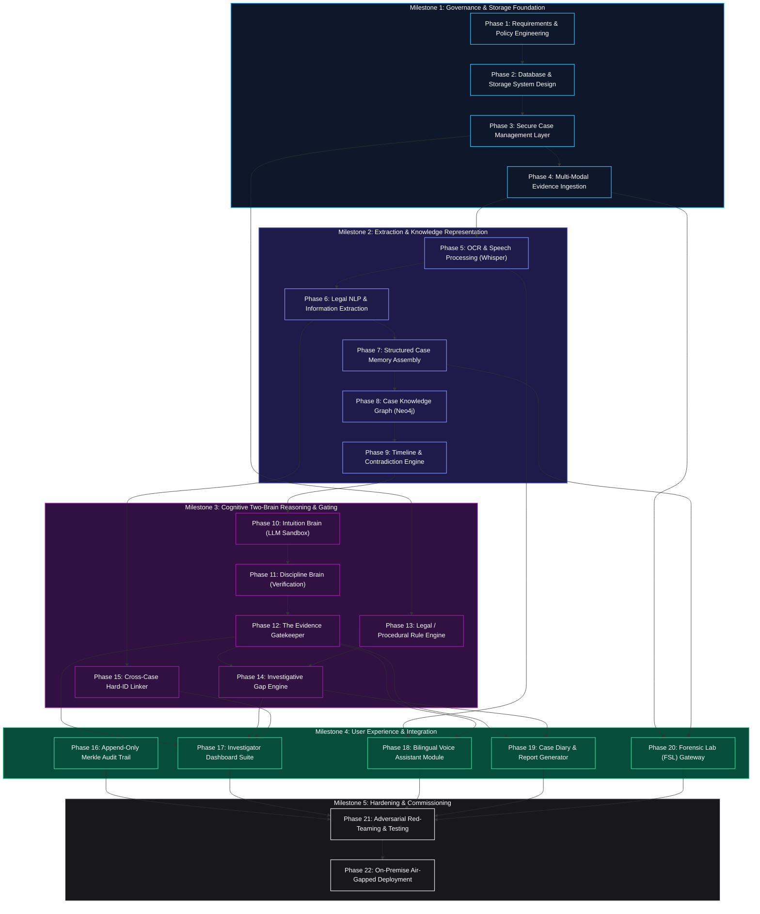

---

## 7. Technology Mapping

Every architectural tier is mapped to a production-grade, technically implementable technology:

| Module / Tier | Selected Technology | Technical Suitability & Justification |
| :--- | :--- | :--- |
| **Frontend UI** | **Next.js 14 / React / Tailwind CSS / D3.js** | Server-side rendering ensures zero client-side credential exposure; D3.js provides high-performance rendering for interactive timelines and citation graphs. |
| **Backend Framework** | **Python FastAPI (Asyncio)** | High concurrency; native compatibility with PyTorch, vLLM, and HuggingFace ecosystems; auto-generated OpenAPI documentation. |
| **Relational Case DB** | **PostgreSQL 16 (JSONB & ACID)** | Enterprise ACID reliability; rich support for semi-structured legal documents via JSONB; native row-level security for multi-tenant case isolation. |
| **Knowledge Graph** | **Neo4j Enterprise Edition** | Native Property Graph model; optimized Cypher traversal for multi-hop entity relationships and evidentiary provenance tracking. |
| **Vector Search (Secondary)** | **Qdrant / pgvector** | Isolated vector embedding indexing; used strictly for semantic retrieval acceleration, completely subordinate to primary structured evidence. |
| **Object Vault (WORM)** | **MinIO Enterprise (Object Lock)** | S3-compatible, high-throughput on-premise storage; certified Object Lock Compliance Mode guarantees immutable WORM legal compliance. |
| **Audit Ledger** | **Immudb (Cryptographic Ledger)** | High-speed, tamper-evident append-only ledger based on cryptographic Merkle trees; mathematical proof of immutability for Section 65B/63 certificates. |
| **OCR Engine** | **PaddleOCR + Tesseract 5** | Multi-engine layout-aware OCR; specialized in regional Indian scripts (Malayalam) as well as English typed police panchnamas. |
| **Speech-to-Text (ASR)** | **Faster-Whisper (On-Premise)** | Locally deployed, fine-tuned transformer ASR capable of accurate transcription of code-switched Malayalam-English voice recordings. |
| **NLP & Entity Extractor** | **spaCy + Legal-BERT + Duckling** | Legal token classification; Duckling handles deterministic extraction and resolution of fuzzy temporal expressions into ISO 8601 intervals. |
| **LLM Inference Core** | **vLLM / Llama-3-70B-Instruct** | State-of-the-art open-source LLM; deployed on sovereign air-gapped GPU servers with PagedAttention for low-latency synthesis. |
| **Identity & Access (IAM)** | **Keycloak (OAuth2.0 / OIDC / FIDO2)** | Open-source enterprise IAM supporting hardware smart cards, biometric OTPs, and granular Attribute-Based Access Control (ABAC). |
| **Deployment Infrastructure** | **Docker / Kubernetes / Air-Gapped Linux** | Isolated on-premise deployment; zero internet egress ensures complete national data sovereignty and security of police records. |

---

## 8. Summary of Pipeline Integrity Verification

1. **Closed-Loop Feedback:** Field inquiries generated from detected gaps continuously update the case memory, ensuring an iterative, living investigation file.
2. **Deterministic Gating:** Generative AI output is intercepted by the Discipline Brain and Evidence Gate; no unverified hallucination can reach the investigator.
3. **Hard-ID Integrity:** Cross-case discovery is firewalled against subjective MO or behavioral matching, operating solely on verified machine tokens.
4. **Court Admissibility:** The append-only Merkle ledger produces Section 65B IEA / Section 63 BSA electronic evidence certificates that withstand judicial scrutiny.
